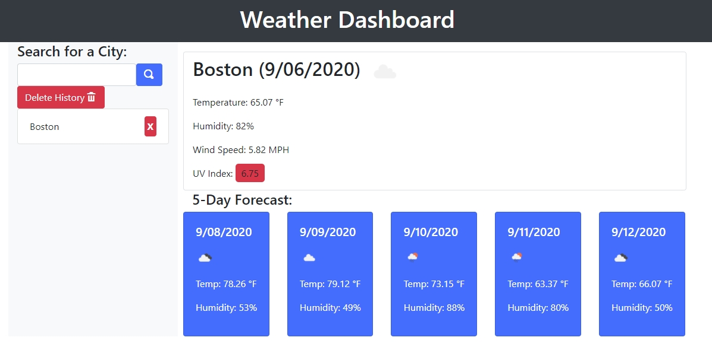

# Weather Dashboard
## Table of Contents
- [Summary](#summary)
- [HTML Approach](#html-approach)
- [CSS Technologies](#css-technologies)
- [Javascript](#javascript)
- [Functionality Exceeding Acceptance Criteria](#functionality-exceeding-acceptance-criteria)
- [Deployed Application](#deployed-application)
- [Screenshot](#screenshot)
- [Animated Screenshot](#animated-screenshot)

## Summary
In this project, a Web pages that uses the OpenWeather API has been created to retrieve weather data for cities. The current weather conditions for that city, as well as a five-day forecast, are presented to the user. When a city's weather is searched, that city is added to the search history and the city's conditions can be re-queried from the history. Current weather conditions for that city include the city name, the date, an icon representation of weather conditions, the temperature, the humidity, the wind speed, and the UV index. The value of the UV index color coded to indicate whether the conditions are favorable, moderate, or severe according to thresholds used by the Environmental Protection Agency. The five-day forecast displays the date, an icon representation of weather conditions, the temperature, and the humidity.

## HTML Approach
- Templates used in the HTML provide areas for the data to be populated

## CSS Technologies
- Bootstrap library and grids are used for most of the presentation and styling
- Results panels are hidden from the user until a search is made by the user

## Javascript
- jQuery used for DOM manipulation
- Promises used to fetch weather data from OpenWeather API
- Promises chained to gather latitude, longitude for additional API calls
- API call to ZipCode lookup API if user only supplies a city and state, which would cause the OpenWeather API to fail
- Heroku CORS API is used to prevent cross-origin resource sharing issues with ZipCode lookup API
- API failures logged to result panes
- History persisted using localStorage
- History of successfully searched cities maintained so that cities are not duplicated in search history
- Search history is able to be deleted all at once or one city at a time
- UV Index color coding standards come from thresholds at https://www.epa.gov/sunsafety/uv-index-scale-0

## Functionality Exceeding Acceptance Criteria
- All search history can be deleted with one button
- Each city in search history can be deleted one at a time
- OpenWeather API cannot search on just city and state, so if user enters just a city and state, a zip code is looked up and appended to search so it will work
- All entered or derived search strings are saved in history
- API errors are displayed in result panes

## Deployed Application
- The web page can be found at [https://jesseparent.github.io/weather-dashboard/](https://jesseparent.github.io/weather-dashboard/)

## Screenshot
- The screenshot of the final work: 

## Animated Screenshot
- The animated screenshot showing all functionality: 
